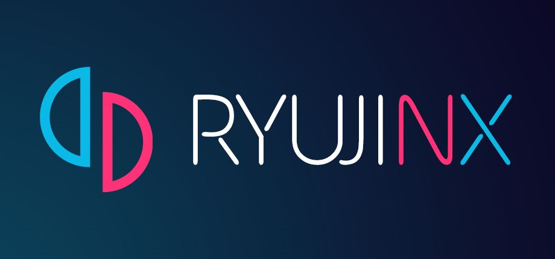

# Ryujinx Emulator

**All‑in‑one tool for Ryujinx – firmware manager, key installer, game updater, and save backup.**

---

## What is Ryujinx Companion?

**Ryujinx Companion** is a lightweight desktop application that simplifies the management of your Ryujinx emulator. It provides a friendly interface for:

- Installing firmware updates (downloading and extracting official Nintendo firmware)
- Managing product keys (prod.keys and title.keys)
- Updating game updates (DLC, patches) directly from your library
- Backing up and restoring save files for any game
- Monitoring system requirements and performance settings

It runs on both **Windows** and **macOS** and requires no extra dependencies beyond the .NET runtime.

---

## Features

| Feature | Description |
|---------|-------------|
| Firmware Manager | Download and install the latest firmware from official sources |
| Key Installer | Import prod.keys and title.keys with validation |
| Game Updater | Check for game updates and install them automatically |
| Save Backup | One‑click backup and restore for all your game saves |
| Library Scanner | Scan your game directory and display titles with cover art |
| Performance Presets | Quick toggle between performance and compatibility modes |
| Cross‑Platform | Works on Windows 10/11 and macOS 11+ (Intel + Apple Silicon) |

---

## Requirements

- Windows 10 / 11 (64‑bit) or macOS 11+ (Intel / M1/M2)
- .NET 6.0 or higher (included in the installer if needed)
- Ryujinx emulator already installed (any recent version)
- Internet connection (for firmware and update downloads)

> Linux is not officially supported, but you can run the source code with .NET Core.

---

## Installation

1. Click the button above or go to Releases.
2. Download the installer for your OS:
   - RyujinxCompanion-Setup.exe for Windows
   - RyujinxCompanion.dmg for macOS
3. Run the installer – on Windows, if SmartScreen appears, click More info → Run anyway.
4. Launch the app and point it to your Ryujinx installation folder.

---

## How it works

The application follows a simple pipeline:

1. Start the application – load the main window.
2. Locate Ryujinx – either automatically detect the installation path or ask the user to select it.
3. Scan the game library – parse the games directory and fetch metadata (title, version, cover art).
4. On user request:
   - Firmware installation: download the latest firmware ZIP, extract it, and copy files to the Ryujinx system folder.
   - Key installation: validate and copy prod.keys / title.keys to the appropriate Ryujinx directory.
   - Game update: identify the installed game, download and apply the update (patch NSP or NSZ).
   - Save backup: compress the save folder for a selected title into a ZIP file, or restore from a previous backup.
5. Log all actions to a local file for debugging.

---

## Project Structure

The source code is organised as follows:

- src/RyujinxCompanion/ – Main application project (C#, .NET 6).
  - Program.cs – Entry point and application lifecycle.
  - MainWindow.xaml – WPF / Avalonia UI main window.
  - FirmwareManager.cs – Downloads and installs firmware.
  - KeyManager.cs – Validates and installs product keys.
  - GameManager.cs – Scans library, handles updates, and save backup.
  - Settings.cs – User preferences and paths.
- resources/ – Icons and preview images.
  - icon.ico – Windows icon.
  - icon.icns – macOS icon.
  - preview.png – Repository social preview.
- .github/workflows/ – CI configuration for building installers.
  - build.yml – Builds for Windows and macOS.
- Root files: RyujinxCompanion.sln, LICENSE, README.md.

---

## FAQ

Q: Do I need to download firmware separately?
A: No – the companion can download the latest official firmware from a trusted source and install it automatically.

Q: Where can I get product keys?
A: Product keys are not provided by this tool. You must dump them from your own legally owned Nintendo Switch console.

Q: Will this break my existing Ryujinx setup?
A: No – the tool only adds or updates files in the Ryujinx directories. It does not overwrite your configuration unless you explicitly choose to.

Q: Can I use it with portable Ryujinx?
A: Yes – just point the companion to your portable folder.

Q: Does it support game updates from multiple regions?
A: Yes – it detects the installed region and downloads the appropriate update file.

Q: Is there a portable version of the companion?
A: Yes – the Windows release includes a portable .exe version that does not require installation.

---

## Contributing

Pull requests are welcome. For major changes, please open an issue first to discuss what you'd like to change.

1. Fork the repository.
2. Create a feature branch: git checkout -b feature/your-feature.
3. Commit your changes.
4. Open a Pull Request.

---

## Disclaimer

This project is not affiliated with Ryujinx or Nintendo. All firmware and keys must be obtained legally from your own console. The tool does not provide any copyrighted material.

---

## License

Distributed under the MIT License. See LICENSE for details.

---

Made for Windows & macOS · Ryujinx management made easy · Open Source

